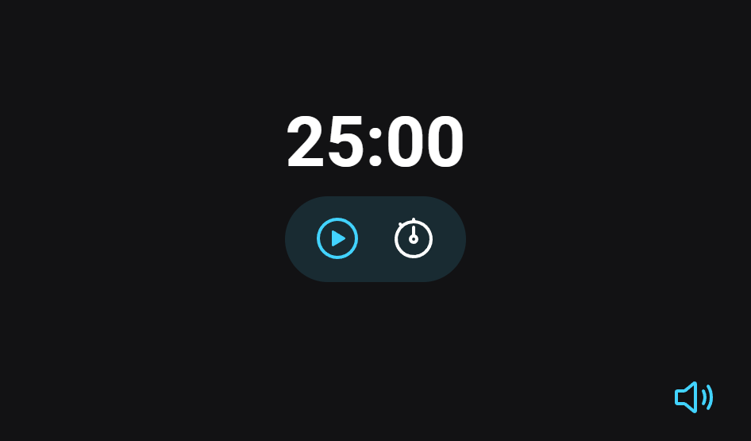

  

	
<h4 align="center"> 
	🚀 Projeto 11 | Stage 05 - Explorer
</h4>

  

  
  
  
  
  <a href=""> ▶️ Visualizar Deploy </a>

<h2 align=left> 💻 Sobre o projeto </h3>

 Projeto realizado durante o programa <strong>Explorer</strong> da <a href="https://www.rocketseat.com.br/"> <strong>Rocketseat</strong> </a>. É o décimo primeiro projeto do programa, localizado no nível 5, onde construímos um timer para conhecer conceitos de DOM, funções callbacks, recursividade, princípios de Clean Code, escopos, es6 Modules, padrão factory, injeção de dependências e áudios pelo js. 

  
<h2 align=left> 🛠 Tecnologias utilizadas </h3>

  
  
  

<h2 align=left> 🎨 Layout </h2>
<a href="https://www.figma.com/file/z51k8B7bz2y99yOtNQohVn/Explorer-Stage-05-Projeto-01-(Copy)?node-id=0%3A1"> Visualizar no Figma </a>  

<h4>💻 Desktop </h4>

